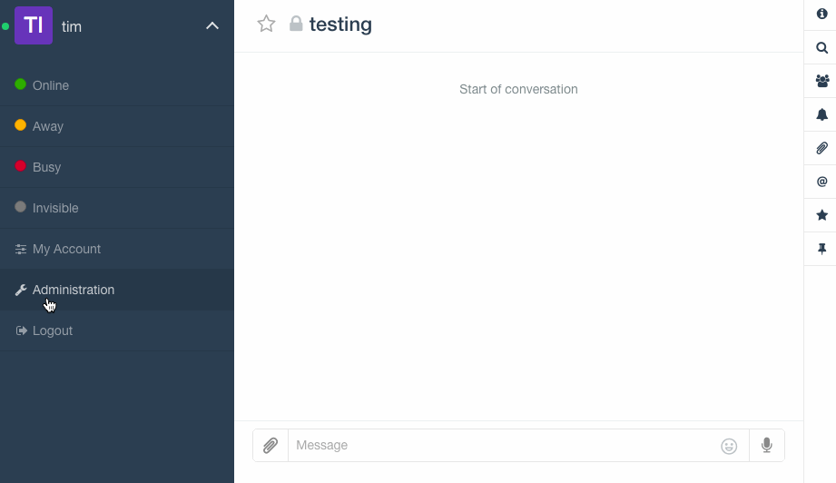
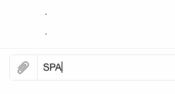

**Hubot** is the handy chat bot framework from GitHub.

**Rocket.Chat** is the community driven open source Slack clone.

In this article I take an MVP approach to building an announcements bot called Crier, to allow Rocket.Chat admins to send direct message announcements to all users.

Rocket.Chat comes with Hubot support and the ability to add bot users that can assist humans and run automation and integration tasks. Out of the box these bots can’t do a whole lot other than listen and respond with canned text, but they're infinitely extensible through node packages.

This guide covers (almost literally) everything I've learned, starting from nothing and creating a functional chat bot with unique and hopefully helpful behaviour.

___

## Tech Stack

[**Rocket.Chat**](<https://github.com/RocketChat/Rocket.Chat>) (a Meteor app) comes with a built-in Hubot, called _Rocketcat_, as well as default roles / permissions for adding more Hubot users.

[**Hubot**](https://github.com/github/hubot) comes with a handful of example scripts, but most of its behaviours come from _external scripts_, each with their own node package repo.

The [**hubot-rocketchat adapter**](https://github.com/RocketChat/hubot-rocketchat) passes the user, room and messaging data between the two, extending Hubot with the core features of the Rocket.Chat platform, like direct messaging.

The [**external-scripts.json**](https://hubot.github.com/docs/#scripts) file within each Hubot is the manifest of node packages that it uses. These packages (usually coffeescript) each contain a single behaviour and can be chained together to great effect.

[**Hubot generator for Yeoman**](https://github.com/github/generator-hubot) provides the scaffolding for a boilerplate Hubot, where [**Hubot Script with Gulp **](https://github.com/sanemat/generator-hubot-script-gulp) generates scaffolding for  external scripts.

[**Rocket.Chat bot helpers**](https://github.com/timkinnane/rocketchat-bot-helpers) is my own Meteor package that extends Rocket.Chat with some helper functions to easily access data collections that are helpful to many bot interactions.

[**Hubot MongoDB Brain**](https://github.com/shokai/hubot-mongodb-brain/) is an node package (hubot script) that lets Hubot use Mongo (as does Rocket.Chat) for persistent storage of its brain. Hubot brains stores and retrieves data used by scripts in key value pairs (in Redis by default).

___

## Set Up

Prerquisites are; local Rocket.Chat instance, Node/NPM and Yeoman.

First I set up my project directories for packages that to easily reference each other via symlinks, instead of needing to publish scripts to npm so other packages can call them as dependencies. You don't have to do it this way, but the paths in the tutorial will assume so.

```
+-- rocket.chat
+-- hubot-rocketchat
+-- crier-bot
+-- hubot-scripts
|   +--- hubot-rocketchat-announcement
+-- meteor-packages
|   +--- rocketchat-bot-helpers
```

### Nota bene...

I've included the _hubot-rocketchat_ adapter localy as a fork, because it's still under development and they're seeking contributions. You don't **need** to do that, you could just leave the reference in Hubot's _package.json_ as a standard dependency. However, sometimes you might want to do some integration between Rocket.Chat and Hubot that isn't possible with the current adapter, if you've already got a fork set up instead of hacking around it you can help out by adding your super useful feature straight into the adapter and submitting a PR.

Regarding the **rocketchat-bot-helpers** package, I'm undecided on my approach there ([read the readme](https://github.com/timkinnane/rocketchat-bot-helpers#approach) for more on that). It is a good example of developing and using a custom Meteor package with Rocket.Chat though.

___

## Customising Rocket.Chat

[This issue](https://github.com/RocketChat/Rocket.Chat/issues/1859) covers the ongoing discussion on how to use custom packages with Rocket.Chat. The easiest way is just modifying the core repo, put your package with all the others. That may cause more complications for merging and deploying new versions of Rocket.Chat though.

I've found the lowest impact method for local development is using the environment variable `PACKAGE_DIRS`. When adding packages with `meteor add`, Meteor will look in the standard packages folder first, then additional directories in `PACKAGE_DIRS`, only if it doesn't find it there will it try to download from npm. So I set a sibling package folder for repos external to the rocket.chat instance.

1. Clone the package repo into `meteor-packages`
2. Set the relative parent folder from Rocket.Chat `export PACKAGE_DIRS='../meteor-packages'`
3. Add it to Rocket.Chat with `meteor add rocketchat-bot-helpers` or whatever package name.

That registers the package in `.meteor/packages` and on next build it updates `.meteor/versions` with the package version (it's kind of a lock file). To make it easier to merge upstream changes to Rocket.Chat I move my custom package references in both files to the end of the file after a line space.

It might be even easier to not even fork Rocket.Chat, just clone it then stash and restore those two file changes whenever you want to pull down the latest version.

Every time you edit and save the package, Meteor will reload and refresh the client.

You're now running a custom package! This is what success tastes like.

___

## Creating a Hubot

Start by setting a Hubot project scaffold in the bot folder using Yeoman.
Make sure your generators are up to date, then:

`yo hubot --adapter="rocketchat"`

You don't have to specify adapter, it will ask you anyway. I have that command saved as everything other question is relative to the bot instance.

Hubot will generate your project...

```
                     _____________________________
 _____              /                             \
 \    \             |   Self-replication process   |
 |    |    _____    |          complete...         |
 |__\\|   /_____\   \     Good luck with that.    /
   |//+  |[^_/\_]|   /----------------------------
  |   | _|___@@__|__
  +===+/  ///     \_\
   | |_\ /// HUBOT/\\
   |___/\//      /  \\
         \      /   +---+
          \____/    |   |
           | //|    +===+
            \//      |xx|
```

Now is a good time to `git init` and push a first commit to a new Hubot repo.

### Hubot Config

Hubot configuration relies on a [range of environment variables](https://github.com/RocketChat/hubot-rocketchat#configuration-options). Normally these would be set in Docker containers or the remote host. For local development I choose not to use Docker to simplify the stack and avoid the challenge of linking unpublished packages between environments.

The only problem then is managing environment vars per directory. I solve that using a ZSH function, which executes an environment config file (if found) when changing directories.

There's plenty [other](http://swapoff.org/ondir.html) [ways](http://pm2.keymetrics.io/docs/usage/pm2-doc-single-page/) of doing it, but here's the function i use in my ZSH bash profile:

```
function chpwd() {
  if [ -r $PWD/.sh_config ]; then
    source $PWD/.sh_config
  fi
}
```

Then _.sh_config_ contains my Hubot configs:

```
export HUBOT_LOG_LEVEL=debug
export ROCKETCHAT_URL='http://localhost:3000'
export ROCKETCHAT_USER='announcements'
export ROCKETCHAT_PASSWORD='hubot'
export ROCKETCHAT_AUTH='password'
export ROCKETCHAT_ROOM='general'
export LISTEN_ON_ALL_PUBLIC='true'
export RESPOND_TO_DM=false
export RESPOND_TO_EDITED=true
export MONGODB_URL=mongodb://127.0.0.1:3001/hubot-brain
export PORT=3003
```

I only set the port for consistent debugging access, will get into that later.

Exclude _.sh_config_ from git. You don't want passwords etc in your public repo.

### MongoDB Brain

I've given Mongo DB settings to Hubot because the first modification I make is to use MongoDB instead of Redis for persisting Hubot brain data. [More discussion on that here](https://github.com/RocketChat/hubot-rocketchat/issues/112), but the pros are generally thus...

- Using Mongo for both Rocket.Chat and Hubot means one less thing in the stack.

- If using mLab in Heroku, both DBs can be mapped to the same account / data store (e.g. AWS).

- Any external apps (logs, admin consoles, DB clients etc) could access both data stores the same way.

For Hubot to use the MongoDB script (or any other external scripts), you need to first install the pakcage via npm:

`npm install hubot-mongodb-brain --save`

Then add it to `external-scripts.json` swapping out the Redis line.

\- `"hubot-redis-brain",`
\+ `"hubot-mongodb-brain",`

### External Scirpts

I also remove the following scripts which are not useful for this project:

`"hubot-google-images", "hubot-pugme", "hubot-maps", "hubot-shipit"`

Removing them from npm as well:

`npm uninstall hubot-google-images hubot-pugme hubot-maps hubot-shipit --save`

### Bot User

For Hubot to use Rocket.Chat it needs the user added as per the environment settings. Create the user though Rocket.Chat admin, setting the bot user type and whatever password you set in the environment configs.



Now run your bot from terminal in the Hubot path, specifying the adaptor.

`bin/hubot -a rocketchat`

If there's no errors, you should see the user come online in Rocket.Chat
That's it, commit those changes. Now we're cooking.

___

## Creating a Hubot Script

Generate the script package with `yo hubot-script-gulp` in its own folder under _hubot-scripts_.

I've called this script **hubot-rocketchat-announcement**. Using the "hubot-rocketchat-" prefix as a naming conventions for scripts specific to Rocket.Chat spares Hubot devs in other platforms the frustration of figuring out why this script doesn't work there.

The generator will get you most of the way with provided answers and defaults, however check your _package.json_ file for correct details, e.g. The author field is used as the git path, which is wrong in my case. I also add `"rocketchat", "Rocket.Chat"` to the keywords, so it can be easily found.

Then `npm install`

### Script Structure

We'll begin with something very simple, make Hubot use it, then test it in the wild before adding advanced logic. That way we can interact and test our script as we develop by simply restarting Hubot.

`gulp test` or just `gulp` runs unit tests but I won't cover that in more detail here.

The main _index.coffee_ file just loads in any files creatied in src. I add a simple error logging function to I don't need it within the script logic.

```
  robot.error (err, res) ->
    robot.logger.error "#{err}\n#{err.stack}"
    if res?
      res.reply "#{err}\n#{err.stack}"
```

Under _src_ there is _script-demo.coffee_. Take note of the comment structures. Other Hubot scripts such as [hubot-help](https://github.com/hubot-scripts/hubot-help) use the front-matter comments in external scripts to let Hubot self report usage information, so make this content useful to users as well as devs. e.g.

### Adding Commands

The [Hubot docs](https://hubot.github.com/docs/scripting) are the best resource for info on scripting. Generally though, there are two main types of listeners and responders.

* **respond** listeners only fire when the matched message was addressed to the bot
* **hear** listeners will fire whenever there's a match in a room they're listening
* **reply** responders will address the response to the user who sent the matched message
* **send** responders just say the response in the room, without addressing anyone
* **sendDirect** is added by the Rocket.Chat adapter, to respond via direct message

Try changing the example script to make it our own.

```
module.exports = (robot) ->
  robot.respond /sparkles/i, (msg) ->
    msg.reply "(ﾉ^ヮ^)ﾉ*:・ﾟ✧"

  robot.hear /marco/i, (msg) ->
    msg.send "polo"
```

### Local Linking

To avoid publishing an incomplete buggy script to NPM, we need Hubot to reference it locally.

From the script folder in terminal run `npm link` to create the source of a package symlink.

Go to the Hubot folder and use `npm link hubot-rocketchat-announcement` to create the link back to the source.

Add `"hubot-rocketchat-announcement": "0.0.0"` to _package.json_ dependencies.

Add `hubot-rocketchat-announcement` to _external-scripts.json_ array

Run Hubot with  `bin/hubot -a rocketchat`. It will install and load the script from your local source on every run.

Test your new commads, use `marco` in a room, or `@concierge: sparkles`.



OK now commit. You've made a functioning Hubot with custom scripts!

___

## Scripting with User Data

TBC.

___

## Publishing Scripts

Just some cliff notes on publishing your npm package when you're done.

At top and bottom of readme remove unused default shield variables. I just keep:

`[![NPM version][npm-image]][npm-url]`

and

```
[npm-url]: https://npmjs.org/package/hubot-rocketchat-announcement
[npm-image]: http://img.shields.io/npm/v/hubot-rocketchat-announcement.svg?style=flat
```

Patch your first version.

```
npm version patch -m "Init version"
git push remote origin
npm publish
```

Remove local linked package so you can use the published one.
  
```
/usr/local/lib/node_modules
rm hubot-rocketchat-announcement
```

Install your published script package back into Hubot.

`npm install --save hubot-rocketchat-announcement`

___

## Debugging Hubot!

I found some Hubot concepts a bit of a black box, as someone not too familiar with writing apps where there's no exposed compiler or presense that's viewable at runtime other than the chat interface. After trial and error I found a fairly simple method then a more complicated but superior approach. I've document both if you want to start simple.

### Manual Execute and Inspect (easy way)

Use [node instector](https://github.com/node-inspector/node-inspector) to debug Hubot once it's running.

`npm install -g node-inspector`

You can't run node-inspector directly on the binary, because it executes through a shell script (node-inspector can only debug node apps, it throws errors reading the binary). So run Hubot and node-inspector as concurrent processes and get Hubot's PID.

`bin/hubot -a rocketchat & node-inspector`

I will give you back a PID of the executed command and some node-inspectors info:

```
[1] 50000
Node Inspector v0.12.8
Visit http://127.0.0.1:8080/?port=5858 to start debugging.
```

In a new terminal, attach node-inspector debugger to the running PID (this is black magic)

`kill -s SIGUSR1 50000` replace with your PID

Back in the Hubot terminal it will say something like:

```
Starting debugger agent.
Debugger listening on port 5858
```

Then just go to the [node inspector web UI](http://127.0.0.1:8080/?port=5858) with Chrome. Find your Hubot scripts files, add some breakpoints, get debuggin. Happy times.

#### Note on creating process armies...

While playing around running concurrent processes, I may end up with clones of Hubot, Metor and Node running in the background and getting port unavailable errors as they try to use the same resources. To kill all those little guys and wipe the slate clean:

Killing Hubots ```kill -9 `ps ax | grep hubot | awk '{print $1}'` ```

Killing Meteors ```kill -9 `ps ax | grep node | grep meteor | awk '{print $1}'` ```

### Monitor and Auto-Inspect (better way)

Building on the simple approach, I use [nodemon](http://nodemon.io/) to execute Hubot so it can watch the source and restart the bot when it detects changes.

`npm install -g nodemon node-inspector opener`

To avoid heavy use of command args, I set up a nodemon config file **nodemon.json**:

```
{
  "verbose": true,
  "ignoreRoot": [".git"],
  "watch": ["node_modules/**/*.js", "node_modules/**/*.coffee", "external-scripts.json"],
  "exec": "coffee --nodejs --debug node_modules/hubot/bin/hubot --name 'hubot' -a rocketchat",
  "ext": "js json coffee"
}
```

It executes Hubot directly through the coffeescript compiler with debug args so you don't need to link the process to node-inspector manually. Redefining `ignoreRoot` lets nodemon watch directories it ignores by default, like node_modules.

Use npm scripts to shorthand. In **package.json**:

```
  "scripts": {
    "run": "bin/hubot -a rocketchat",
    "watch": "nodemon",
    "debug": "opener http://127.0.0.1:3004/?port=5858 && node-inspector --web-port=3004 --web-host=localhost & nodemon"
  }
```

**run** is basic, **watch** runs Hubot through nodemon, **debug** runs/watches Hubot in parralel with the inspector and pops it open for you. 

Just `npm run debug`

___

## Victory.

`ೕ(•̀ㅂ•́ )`